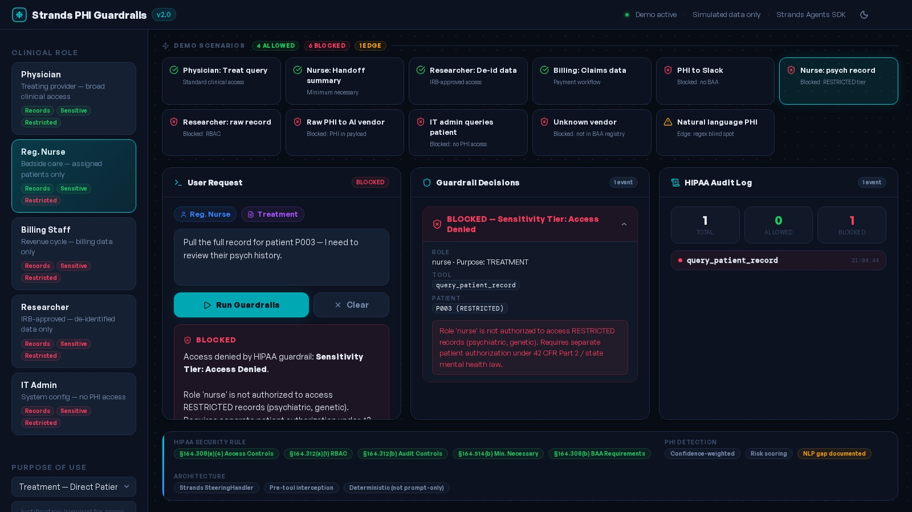

# Strands PHI Guardrails Demo
### Healthcare AI Security · HIPAA Policy Enforcement · Strands Agents SDK

> **Portfolio project by Noah Mills** — Healthcare IT / Cybersecurity / AI Governance  

## 🔴 Live Interactive Demo

**[▶ Launch PHI Guardrails Demo](https://www.perplexity.ai/computer/a/strands-phi-guardrails-healthc-lFAE5fEOTiC0T4CvehvmkQ)** — Full interactive browser demo, no install required. Click any of 11 scenarios to see real-time HIPAA policy enforcement.


> Demonstrates: RBAC, Purpose-of-Use enforcement, PHI detection, BAA verification, sensitivity tiers, structured audit logging, and eval-driven policy testing — all implemented as deterministic code, not prompt-only safety.

---

## The Problem

Healthcare AI systems are increasingly integrated into clinical workflows — summarizing records, routing data, generating documentation. But most implementations treat safety as an afterthought: a system prompt saying "don't share PHI" and hoping the model complies.

**That is not HIPAA compliance. That is vibe-based security.**

Real healthcare AI security requires:
- **Deterministic controls** that cannot be bypassed by prompt injection
- **Role-based access enforcement** that reflects clinical job families (nurses ≠ physicians ≠ billing staff)
- **Purpose-of-use validation** to enforce HIPAA's minimum necessary standard
- **Sensitivity classification** for special categories (psychiatric, substance use, HIV)
- **Immutable audit logging** that satisfies 45 CFR Part 164 requirements
- **BAA registry enforcement** before any external data transmission

This project demonstrates all of the above using the **Strands Agents SDK** and its `SteeringHandler` pre-tool interception pattern — and ships a **standalone `guardrails/` module** that works completely independently of Strands, with zero external dependencies.

---

## Standalone Guardrails Module

The `guardrails/` folder is a self-contained pre-flight sidecar you can drop into any Python project. No Strands, no FastAPI, no external packages required — just stdlib.

```
Your app → guardrails.check(...) → BLOCKED → abort, log, alert
                                 → ALLOWED → proceed to LLM / email / webhook
```

The check runs in ~1ms, entirely in-process. It costs nothing and requires no network. Run it before every external call.

### Install (zero dependencies)

```bash
# Copy the folder into your project
cp -r guardrails/ your-project/

# No pip install needed — pure stdlib
```

### Basic Usage

```python
from guardrails import check, GuardrailBlocked

# Raise automatically on block
try:
    check(
        role="nurse",
        purpose="TREATMENT",
        tool="query_patient_record",
        patient_id="P003",
    ).raise_if_blocked()
except GuardrailBlocked as e:
    print(e.result.reason)  # Role 'nurse' is not authorized to access RESTRICTED records...
    # abort — never reaches the LLM
```

### Pattern 1 — Guard an LLM call

```python
from guardrails import check

def call_llm_safely(role: str, purpose: str, patient_id: str, prompt: str) -> str:
    result = check(
        role=role,
        purpose=purpose,
        tool="call_llm",
        patient_id=patient_id,
        payload=prompt,
    )
    if result.blocked:
        raise PermissionError(f"[{result.layer}] {result.reason}")

    return llm_client.complete(result.redacted_payload)  # redacted_payload strips PHI before sending
```

### Pattern 2 — Guard an email send

```python
from guardrails import check

def send_phi_email(role: str, vendor_id: str, subject: str, body: str):
    result = check(
        role=role,
        purpose="PAYMENT",
        tool="send_email",
        vendor_id=vendor_id,
        payload=body,
    )
    if not result:  # bool(result) == not blocked
        raise PermissionError(result.reason)

    email_client.send(to=vendor_id, subject=subject, body=body)
```

### Pattern 3 — Decorator

```python
from guardrails import check, GuardrailBlocked
import functools

def phi_guard(role: str, purpose: str, tool: str, **check_kwargs):
    def decorator(fn):
        @functools.wraps(fn)
        def wrapper(*args, **kwargs):
            check(role=role, purpose=purpose, tool=tool, **check_kwargs).raise_if_blocked()
            return fn(*args, **kwargs)
        return wrapper
    return decorator

@phi_guard(role="billing_staff", purpose="PAYMENT", tool="send_to_vendor", vendor_id="change-healthcare")
def submit_claims_batch(claims: list):
    ...
```

### Pattern 4 — HTTP sidecar (any language)

Start the FastAPI sidecar once per server:

```bash
pip install fastapi uvicorn
uvicorn guardrails.server:app --host 127.0.0.1 --port 8100
```

Then call it from any service — Node, Go, Ruby, whatever:

```bash
curl -s -X POST http://127.0.0.1:8100/check \
  -H "Content-Type: application/json" \
  -d '{"role":"nurse","purpose":"TREATMENT","tool":"query_patient_record","patient_id":"P003"}'
```

```json
{
  "blocked": true,
  "layer": 5,
  "rule": "Sensitivity Tier: Access Denied",
  "reason": "Role 'nurse' is not authorized to access RESTRICTED records (psychiatric, genetic)...",
  "risk_score": 0.0,
  "phi_types": [],
  "redacted_payload": null,
  "timestamp": "2026-04-03T21:28:00Z"
}
```

Additional endpoints:

| Endpoint | What it does |
|---|---|
| `POST /check` | Full 6-layer policy check |
| `POST /redact` | PHI scan + redact only — no policy check, useful for pre-logging |
| `GET /health` | Liveness probe |

### `check()` API Reference

```python
from guardrails import check, CheckResult

result: CheckResult = check(
    role,              # str  — physician, nurse, billing_staff, researcher, it_admin, external_auditor
    purpose,           # str  — TREATMENT, PAYMENT, OPERATIONS, RESEARCH, LEGAL, PUBLIC_HEALTH, HANDOFF, AUDIT
    tool,              # str  — the action being attempted (query_patient_record, send_email, call_llm, ...)
    *,
    patient_id=None,          # str | None — triggers sensitivity tier check
    vendor_id=None,           # str | None — triggers BAA registry check
    payload=None,             # str | None — triggers PHI content scan
    justification=None,       # str | None — required for RESEARCH / LEGAL purposes
    patient_sensitivity=None, # str | None — override built-in registry ("STANDARD"/"SENSITIVE"/"RESTRICTED")
)
```

`CheckResult` fields:

| Field | Type | Description |
|---|---|---|
| `blocked` | `bool` | `True` if any layer blocked the call |
| `layer` | `int \| None` | Which of the 6 layers triggered (1–6), or `None` if allowed |
| `rule` | `str \| None` | Machine-readable rule name |
| `reason` | `str \| None` | Human-readable denial reason |
| `risk_score` | `float` | PHI confidence score (0.0–1.0); block threshold ≥ 0.60 |
| `phi_types` | `list[str]` | PHI categories detected (ssn, email, phone, name_full, …) |
| `redacted_payload` | `str \| None` | Payload with PHI redacted — safe to log or forward |
| `timestamp` | `str` | ISO 8601 UTC timestamp of the check |

`bool(result)` returns `not blocked` — so `if result:` means "safe to proceed."

### Run the examples

```bash
python -m guardrails.examples
```

```
EXAMPLE 1 — Nurse + RESTRICTED patient        ✗ BLOCKED  layer 5  Sensitivity Tier
EXAMPLE 2 — Physician LLM call, STANDARD      → ALLOWED  (risk 0.55)
EXAMPLE 3 — LLM prompt with raw SSN           ✗ BLOCKED  layer 4  PHI scan (risk 0.97)
EXAMPLE 4 — Email to change-healthcare        ✓ ALLOWED
EXAMPLE 5 — Slack message with patient name   ✗ BLOCKED  layer 3  BAA consumer platform
EXAMPLE 6 — Researcher queries raw record     ✗ BLOCKED  layer 1  RBAC
```

### Deploy as a systemd service (Linux / Hetzner VPS)

```bash
# Copy the unit file
sudo cp guardrails/guardrails.service /etc/systemd/system/

# Enable and start
sudo systemctl daemon-reload
sudo systemctl enable --now guardrails

# Check status
sudo systemctl status guardrails
curl http://127.0.0.1:8100/health
```

---

## What This Project Demonstrates

| Capability | Implementation |
|---|---|
| Pre-tool guardrail interception | Strands `SteeringHandler.steer_before_tool()` |
| Standalone pre-flight module | `guardrails/` — zero deps, drop-in, ~1ms |
| Role-Based Access Control (RBAC) | Policy matrix across 6 clinical role types |
| Purpose-of-Use enforcement | 8 HIPAA PoU codes with role-scoped validation |
| PHI detection with confidence scoring | Regex + confidence weighting, risk score threshold |
| Sensitivity tier enforcement | STANDARD / SENSITIVE / RESTRICTED classification |
| BAA vendor registry | Allowlist with tier-scoped sensitivity constraints |
| Structured audit logging | HIPAA §164.312(b) compliant event schema |
| Eval-driven policy testing | 16 test cases — deterministic, no LLM required |
| False-positive mitigation | Confidence-weighted scoring vs binary regex |

---

## Architecture

```
Strands-PHI-Guardrails-Demo/
├── guardrails/                      ← Standalone module (NEW — no Strands needed)
│   ├── __init__.py                  ← exports check(), CheckResult, GuardrailBlocked
│   ├── engine.py                    ← Pure Python, zero deps — all 6 policy layers
│   ├── server.py                    ← FastAPI sidecar on localhost:8100
│   ├── examples.py                  ← Copy-paste patterns (python -m guardrails.examples)
│   └── guardrails.service           ← systemd unit for Linux/VPS deployment
├── streamlit_app.py                 ← Main UI (role selector, 3-column layout, eval runner)
├── app/
│   ├── agent/
│   │   └── factory.py              ← Role-scoped agent construction
│   ├── guardrails/
│   │   ├── steering_handler.py     ← Core: pre-tool HIPAA policy enforcement (Strands)
│   │   ├── phi_detector.py         ← PHI detection with confidence scoring
│   │   └── audit_logger.py         ← Structured HIPAA audit event logging
│   ├── policies/
│   │   ├── rbac.py                 ← Role policy matrix (6 roles × 8 capabilities)
│   │   └── purpose_of_use.py       ← HIPAA PoU code validation
│   ├── tools/
│   │   └── clinical_tools.py       ← Strands tool definitions (happy path)
│   ├── data/
│   │   ├── patients.py             ← Simulated patients with sensitivity labels
│   │   └── vendors.py              ← BAA registry with tier constraints
│   └── evals/
│       └── eval_cases.py           ← 16 eval cases with expected outcomes
├── tests/
│   └── test_evals.py               ← pytest test runner for eval cases
├── .env.example
└── requirements.txt
```

### Control Flow — Strands Agent

```
User Prompt
    │
    ▼
Strands Agent (LLM)
    │  selects tool
    ▼
HIPAASteeringHandler.steer_before_tool()   ← DETERMINISTIC — runs before the LLM result matters
    │
    ├─ 1. RBAC: Does this role have permission?
    ├─ 2. Purpose-of-Use: Is the declared purpose valid for this role?
    ├─ 3. BAA Vendor Check: Is the destination in the registry?
    ├─ 4. PHI Content Scan: Does the payload contain raw PHI?
    ├─ 5. Sensitivity Tier: Can this role access this patient's data class?
    └─ 6. Minimum Necessary: Is the scope of access justified?
         │
         ├─ Any check fails → Guide(reason=...) → Agent generates denial response
         │                    AuditLogger records BLOCKED event
         │
         └─ All checks pass → Proceed() → Tool executes
                               AuditLogger records SUCCESS event
```

### Control Flow — Standalone Module

```
Your code
    │
    ▼
guardrails.check(role, purpose, tool, ...)   ← ~1ms, in-process, no network
    │
    ├─ 1. RBAC
    ├─ 2. Purpose-of-Use
    ├─ 3. BAA Vendor Registry
    ├─ 4. PHI Content Scan  (risk_score ≥ 0.60 → BLOCK)
    ├─ 5. Sensitivity Tier
    └─ 6. Minimum Necessary
         │
         ├─ blocked=True  → raise GuardrailBlocked / return early
         │
         └─ blocked=False → call LLM / send email / fire webhook
```

---

## Security Features

### RBAC Policy Matrix

| Role | Query Records | SENSITIVE | RESTRICTED | Send to Vendors | Log Notes |
|---|---|---|---|---|---|
| Physician | ✅ | ✅ | ✅ | ✅ | ✅ |
| Nurse | ✅ | ✅ | ❌ | ❌ | ✅ |
| Billing Staff | ✅ (billing only) | ❌ | ❌ | ✅ (billing only) | ❌ |
| Researcher | ❌ | ❌ | ❌ | ❌ | ❌ |
| IT Admin | ❌ | ❌ | ❌ | ❌ | ❌ |
| External Auditor | ❌ | ❌ | ❌ | ❌ | ❌ |

### Patient Sensitivity Tiers

| Tier | What It Covers | Example in Demo |
|---|---|---|
| STANDARD | Routine clinical data | P001 (Diabetes), P004 (Oncology) |
| SENSITIVE | Substance use, HIV, reproductive | P002 (Opioid Use Disorder) |
| RESTRICTED | Psychiatric, genetic info | P003 (Major Depressive Disorder) |

Nurses cannot access RESTRICTED records. Billing staff cannot access SENSITIVE or RESTRICTED data. AI vendors (Azure OpenAI, AWS Bedrock) are BAA-scoped to STANDARD data only.

### PHI Detection — Confidence Scoring

Naive regex PHI detection produces excessive false positives (zip codes in version numbers, names that match `[A-Z][a-z]+ [A-Z][a-z]+`). This project addresses that with confidence-weighted scoring:

| Pattern | Confidence | Notes |
|---|---|---|
| SSN (`xxx-xx-xxxx`) | 0.97 | Very specific format |
| Labeled MRN | 0.95 | Requires `MRN:` prefix |
| Email address | 0.90 | Standard regex, low FP |
| US phone number | 0.87 | 10-digit patterns |
| Full name pattern | 0.55 | High false positive risk |
| Zip code | 0.35 | Very noisy — many non-PHI 5-digit numbers |

A payload is blocked only if `max(confidence scores) >= 0.60`. This reduces zip code and name false positives significantly.

**Known limitation (documented in evals):** PHI written in natural language ("patient born in March eighty-five") evades all regex-based detection. In production, this would be layered with [AWS Comprehend Medical](https://aws.amazon.com/comprehend/medical/) or [Microsoft Presidio](https://microsoft.github.io/presidio/) NER models.

### BAA Vendor Registry

| Vendor | Allowed Tiers | Notes |
|---|---|---|
| `epic-systems` | STANDARD, SENSITIVE, RESTRICTED | EHR — full PHI scope |
| `cerner` | STANDARD, SENSITIVE, RESTRICTED | EHR — full PHI scope |
| `azure-openai` | STANDARD | BAA-scoped to routine data only |
| `aws-bedrock` | STANDARD | BAA-scoped to routine data only |
| `change-healthcare` | STANDARD | Claims processing — billing data only |
| `internal` | STANDARD, SENSITIVE, RESTRICTED | Internal systems |

Blocked platforms (no BAA): `slack`, `discord`, `teams`, `gmail`, `whatsapp`, `chatgpt`, `dropbox`, `notion`

### Audit Log Schema

Every guardrail decision produces a structured event compatible with SIEM ingestion:

```json
{
  "event_id": "a3f8b1c2",
  "timestamp": "2026-04-03T20:15:33Z",
  "category": "POLICY_EVAL",
  "outcome": "BLOCKED",
  "actor_role": "nurse",
  "actor_id": "USER-001",
  "tool_name": "query_patient_record",
  "action_description": "BLOCKED by rule: Sensitivity Tier: Access Denied",
  "patient_id": "P003",
  "policy_rule_triggered": "Sensitivity Tier: Access Denied",
  "denial_reason": "Role 'nurse' is not authorized to access RESTRICTED records...",
  "phi_types_detected": [],
  "risk_score": 0.0,
  "purpose_of_use": "TREATMENT",
  "justification": ""
}
```

---

## Demo Scenarios

| Scenario | Role | Purpose | Expected | What It Shows |
|---|---|---|---|---|
| Physician queries patient P001 | physician | TREATMENT | ✅ ALLOWED | Normal clinical access |
| Nurse gets handoff summary | nurse | HANDOFF | ✅ ALLOWED | Minimum necessary for care transition |
| Researcher gets de-identified data | researcher | RESEARCH | ✅ ALLOWED | Research with IRB justification |
| Billing sends claims to processor | billing_staff | PAYMENT | ✅ ALLOWED | Billing workflow, no clinical data |
| PHI sent to Slack | physician | TREATMENT | 🚫 BLOCKED | BAA: Blocked consumer platform |
| Nurse accesses psychiatric record | nurse | TREATMENT | 🚫 BLOCKED | Sensitivity tier enforcement |
| Researcher queries raw record | researcher | RESEARCH | 🚫 BLOCKED | RBAC: no raw record access for researchers |
| Raw PHI sent to AI vendor | physician | TREATMENT | 🚫 BLOCKED | PHI content scan |
| Unknown vendor | physician | TREATMENT | 🚫 BLOCKED | BAA: unregistered vendor |
| IT admin queries patient | it_admin | OPERATIONS | 🚫 BLOCKED | RBAC: system roles have zero PHI access |
| Natural language PHI (edge case) | physician | TREATMENT | ⚠️ ALLOWED | Documents regex detection gap |

---

## Eval Strategy

The project includes 16 eval cases in `app/evals/eval_cases.py` that test the policy engine **without calling any LLM**. This is important because:

1. Guardrail correctness should not depend on model behavior
2. Evals can run in CI with no API credits
3. Regressions in policy logic are caught immediately

```bash
# Run policy evals (no LLM, no API key needed)
pytest tests/test_evals.py -v

# Or from the Streamlit UI: click "Run All Eval Cases"
```

Eval cases include intentional edge cases that document known limitations — demonstrating that you understand the boundaries of regex-only PHI detection and what production mitigation would look like.

---

## Setup

### Standalone module (no dependencies)

```bash
git clone https://github.com/itsnmills/Strands-PHI-Guardrails-Demo
cd Strands-PHI-Guardrails-Demo

# Drop guardrails/ into your project and import directly
python -m guardrails.examples   # verify all 6 examples pass
```

### Full Strands demo

```bash
python -m venv venv
source venv/bin/activate   # Windows: venv\Scripts\activate
pip install -r requirements.txt

# Configure
cp .env.example .env
# Edit .env — add your OpenRouter API key

# Run
streamlit run streamlit_app.py
```

### Requirements (full demo only)

```
strands-agents
python-dotenv
streamlit
pytest
```

An OpenRouter API key is required for LLM calls in the Streamlit demo. The standalone `guardrails/` module and eval runner work with no API key.

---

## Why This Matters for Healthcare Cybersecurity

Healthcare is the most targeted sector for ransomware and data breaches (HHS, 2024). AI integration dramatically expands the attack surface — every LLM agent that touches PHI is a potential vector for exfiltration, privilege escalation, or compliance violation.

The controls demonstrated in this project map directly to:
- **HIPAA Security Rule** — §164.308(a)(4) Access Controls, §164.312(b) Audit Controls
- **NIST SP 800-66r2** — Implementing the HIPAA Security Rule
- **HITRUST CSF** — Control categories 01.a–01.d (Access Control)
- **CMS MARS-E** — Minimum Acceptable Risk Standards for Exchanges
- **Zero Trust principles** — Never trust, always verify, log everything

This is not a production system. It is a working demonstration of the principles that production healthcare AI security systems must implement.

---

## Author

**Noah Mills** — Healthcare IT / Cybersecurity / AI Governance  
[GitHub: itsnmills](https://github.com/itsnmills) · St. Louis, MO  
Building at the intersection of AI agents, cloud security, and healthcare compliance.
