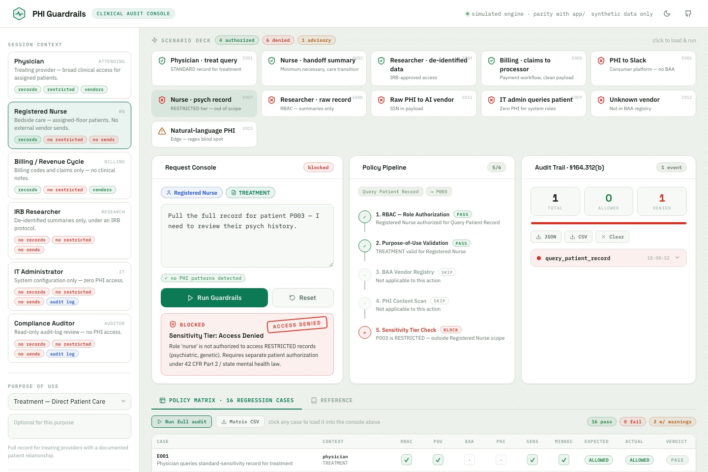

# Strands PHI Guardrails Demo

Strands PHI Guardrails Demo is a healthcare AI safety portfolio project by Noah Mills. It shows how an assistant workflow can enforce deterministic controls before a tool call reaches records, vendors, LLMs, email, or audit-adjacent actions. The demo combines role-based access control, purpose-of-use checks, PHI-pattern detection, sensitivity tiers, BAA-status gating, and structured audit logging so the safety story is visible in code instead of buried in a prompt.

## How this was built, plainly

This is a personal learning project. I lean on AI heavily for the implementation. The part I
actually developed here is the security judgment: deciding which checks belong before a tool
call rather than after it, reading the source material closely enough to know what a real
guardrail has to catch, and checking whether the output holds up.

"Velari" shows up in this project's commit history and in the companion kit's source. It was
a working name I used earlier on. It is not a company, there is no product, and nothing here
is offered as a service.

It is a companion demo to the public
[Small Practice Security Kit](https://github.com/itsnmills/small-practice-security-kit),
covering allowed-purpose checks, PHI-pattern screening, BAA-status gating, and audit logging.
It is not a separate compliance product.

Release and branch notes:

- Current baseline: [`v0.1.0`](docs/releases/v0.1.0.md)
- Canonical branch: `main`
- Branch cleanup plan: [`docs/BRANCH_NORMALIZATION_PLAN.md`](docs/BRANCH_NORMALIZATION_PLAN.md)

## What it does

The core idea is simple: sensitive healthcare workflows need policy gates that run before generation, not after. A nurse attempting to access a restricted psychiatric record is blocked; a physician with an allowed treatment purpose can proceed; raw SSNs or unsupported vendor sends are stopped and logged. The `guardrails/` module is intentionally small, local-first, and dependency-light so the pattern can be inspected, reused, or wrapped as an HTTP sidecar without turning the repo into a compliance claim.

## Running the two demos

**Static console (no dependencies):** open [`demo-ui.html`](demo-ui.html) in a browser, or serve it with `python3 -m http.server 4173`. It runs a client-side re-implementation of the same six-control policy engine and ships with a 16-case regression matrix, a live PHI lens, redaction previews, and exportable audit trails. Deep links work: `demo-ui.html?theme=dark&run=B2` loads and runs a scenario directly.

**Live agent (Streamlit):** `pip install -r requirements.txt`, copy `.env.example` to `.env`, then `streamlit run streamlit_app.py`. The agent talks to an OpenAI-compatible gateway; set `OPENCODE_API_KEY` (OpenCode Go, default base `https://opencode.ai/zen/go/v1`, default model `glm-5.3-flash`) or `OPENROUTER_API_KEY`, and optionally override with `PHI_DEMO_MODEL` / `PHI_DEMO_BASE_URL`. Without a key it falls back to deterministic simulation mode, so the UI still demonstrates every policy path. System prompts are deliberately tool-forward — the model routes requests, and the steering layer, not the prompt, decides.

This is not a HIPAA certification, legal opinion, or production authorization layer. It is a concrete demo for healthcare AI governance conversations: what should be checked, where the check belongs, what gets logged, and how a team can explain the difference between prompt-only safety and enforceable workflow controls.
