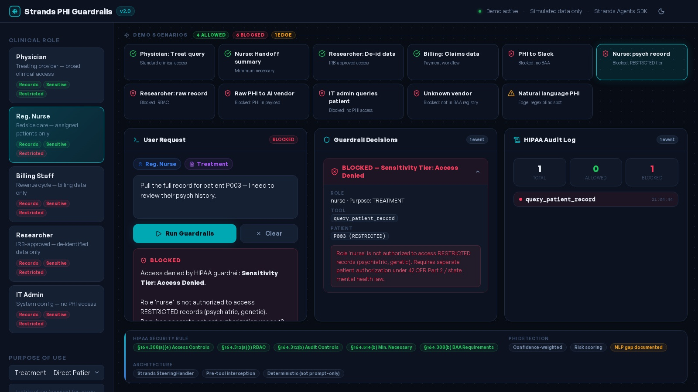

# Strands PHI Guardrails Demo

Strands PHI Guardrails Demo is a healthcare AI safety portfolio project by Noah Mills. It shows how an assistant workflow can enforce deterministic controls before a tool call reaches records, vendors, LLMs, email, or audit-adjacent actions. The demo combines role-based access control, purpose-of-use checks, PHI-pattern detection, sensitivity tiers, BAA-status gating, and structured audit logging so the safety story is visible in code instead of buried in a prompt.

The core idea is simple: sensitive healthcare workflows need policy gates that run before generation, not after. A nurse attempting to access a restricted psychiatric record is blocked; a physician with an allowed treatment purpose can proceed; raw SSNs or unsupported vendor sends are stopped and logged. The `guardrails/` module is intentionally small, local-first, and dependency-light so the pattern can be inspected, reused, or wrapped as an HTTP sidecar without turning the repo into a compliance claim.

This is not a HIPAA certification, legal opinion, or production authorization layer. It is a concrete demo for healthcare AI governance conversations: what should be checked, where the check belongs, what gets logged, and how a team can explain the difference between prompt-only safety and enforceable workflow controls.
