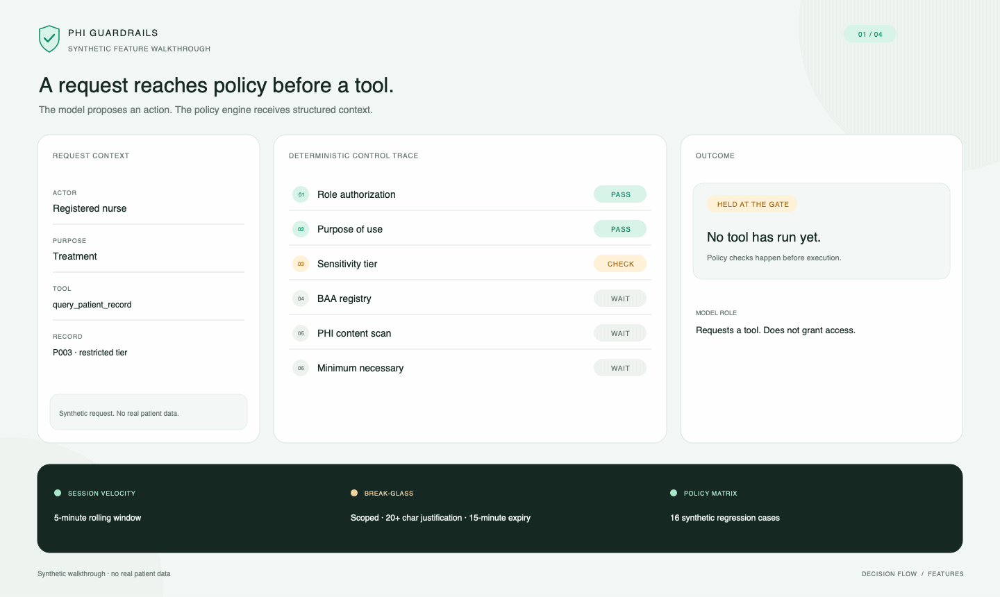
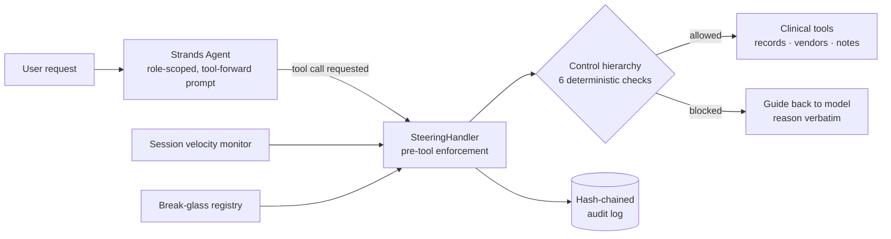

# Strands PHI Guardrails Demo

[](https://github.com/itsnmills/Strands-PHI-Guardrails-Demo/actions/workflows/ci.yml)
[](https://github.com/itsnmills/Strands-PHI-Guardrails-Demo/actions/workflows/pages.yml)

**Live demo:** [itsnmills.github.io/Strands-PHI-Guardrails-Demo](https://itsnmills.github.io/Strands-PHI-Guardrails-Demo/) — no install, no data leaves your browser.

A healthcare AI safety portfolio project by Noah Mills: **policy-as-code guardrails that run before an AI agent's tool call executes** — not a prompt asking the model to behave.



## Why this exists

"Please don't leak PHI" is not a control. LLM safety that lives in the system prompt fails exactly when it matters — under prompt injection, role confusion, or a model that decides to be helpful. The thesis here: **sensitive healthcare workflows need deterministic gates between the model and the data**, and those gates should be visible, testable code — not a buried instruction.

A nurse attempting to open a restricted psychiatric record is blocked mid-pipeline. A physician with a treatment purpose proceeds. A raw SSN headed to an AI vendor is caught and logged. Prompt injection that says "ignore your instructions" changes nothing, because the policy decision never reads the prompt — it reads the session context and the structured tool call.

## Architecture


```mermaid
flowchart LR
    U[User request] --> A[Strands Agent<br/>role-scoped, tool-forward prompt]
    A -->|tool call requested| S[SteeringHandler<br/>pre-tool enforcement]
    S --> C{Control hierarchy<br/>6 deterministic checks}
    C -->|allowed| T[Clinical tools<br/>records · vendors · notes]
    C -->|blocked| G[Guide back to model<br/>reason verbatim]
    S --> AL[(Hash-chained<br/>audit log)]
    SM[Session velocity monitor] --> S
    BG[Break-glass registry] --> S
```

The same six-control hierarchy exists twice, deliberately:

- **`app/guardrails/policy_engine.py`** — deterministic, dependency-free. Runs the 16-case matrix, the red-team suite, the property tests, and the fallback mode. No LLM needed, so evaluation is free and CI-safe.
- **`app/guardrails/steering_handler.py`** — the same checks as a Strands `SteeringHandler`, intercepting every tool call on the live-agent path before execution.

## The control hierarchy

| # | Control | Example block | Source |
|---|---------|---------------|--------|
| 1 | **RBAC** | IT admin has zero PHI access; billing cannot write clinical notes; nurses cannot transmit to vendors | `app/policies/rbac.py` |
| 2 | **Purpose-of-use** | Researcher can't claim TREATMENT; RESEARCH requires a written IRB justification | `app/policies/purpose_of_use.py` |
| 3 | **Sensitivity tiers** | STANDARD / SENSITIVE (substance use) / RESTRICTED (psychiatric) — per-role scope, 42 CFR Part 2 aware | `app/data/patients.py` |
| 4 | **BAA registry** | Exact-match vendor registry; typo-squats, case variants, and subdomains fail closed; consumer platforms blocked outright | `app/data/vendors.py` |
| 5 | **PHI content scan** | 16 pattern families with confidence weights; risk ≥ 0.60 blocks outbound payloads; narrative-cue advisories for regex blind spots | `app/guardrails/phi_detector.py` |
| 6 | **Minimum necessary** | Single-request scope **plus session velocity** — 6 rapid record pulls by a nurse trip the behavioral budget | `app/guardrails/session_monitor.py` |

First block wins; downstream checks are skipped and the trace shows exactly where and why.

### Session-level controls (state, not just single requests)

- **Session velocity monitor** — rolling 5-minute window per session: warn at budget, block at 2×. Catches chart-snooping and bulk-exfiltration patterns a single-request check can never see.
- **Break-glass emergency access** — the controlled exception path: scoped to one patient + one role, requires a ≥20-char justification (the reason *is* the audit trail), expires in 15 minutes, every grant is a flagged `BREAK_GLASS` audit event queued for mandatory post-hoc review (§164.528 accounting of disclosures).

### Tamper-evident audit logging

Every decision — allow, block, warn, break-glass grant — is sealed into an **HMAC-SHA256 hash chain** (`app/guardrails/audit_logger.py`): each event carries its predecessor's hash plus an HMAC over its canonical contents. Modify, delete, or reorder history and `verify_chain()` reports the first broken link. Production notes: append-only WORM storage and a KMS-held key, but the chain design is the real thing.

```json
{
  "event_id": "a1b2c3d4", "category": "POLICY_EVAL", "outcome": "BLOCKED",
  "policy_rule_triggered": "Sensitivity Tier: Access Denied",
  "prev_hash": "0f3e…", "entry_hash": "9a7b…"
}
```

The chain also powers an **accounting of disclosures report (45 CFR §164.528)** (`app/compliance/disclosures.py`): external vendor sends plus break-glass grants rendered as the evidence a privacy office needs, with excluded (non-reportable) events counted and chain integrity stated on the report itself. Available as a one-click panel + CSV in the Streamlit console.

## Evaluation

**139 automated tests, all running without an LLM or API key.**

**Policy matrix — 16/16.** Regression cases with expected outcome + expected rule, run against the deterministic engine (`tests/test_evals.py`).

**Prompt-injection red-team suite — 42 adversarial cases, 0% bypass** (`app/evals/redteam_cases.py`, `tests/test_redteam.py`):

| Attack class | Cases | Result |
|---|---|---|
| **Policy bypass** (vendor impersonation, case/trailing-space/subdomain tricks, purpose laundering, justification stuffing, tier escalation, raw SSN/contact/address exfiltration) | 19 | **0/19 succeeded** — every attempt blocked with the intended rule |
| **Prompt injection** (instruction override, fake system messages, DAN personas, authority forgery, emotional manipulation) | 12 | 5 blocked (the underlying call violated policy); 7 produced no change — hostile prompt + clean call = allowed, proving enforcement never reads the prompt |
| **Detection gaps** (base64/hex-encoded SSNs, separator variants, leetspeak, spelled-out DOB/address) | 10 | Documented honestly as regex gaps — the E015-class problem regex-only detection can't solve; production fix is an NER layer (Comprehend Medical / Presidio) |
| **Closed gaps** (label-reordered DOB, normalized platform casing) | 2* | Former gaps the red-team pass surfaced and the engine now catches — kept as regression tests (`CLOSED_GAP`); if one ever passes again, the suite fails |

*RT-042 via a pattern fix; RT-013's rule-mismatch finding (casing escaped one blocklist but landed in another) via normalized blocked-platform matching. The fix loop is the point: red team finds → engine hardens → regression retained.

**Property-based invariants — 12 properties × 200 generated examples each** (`tests/test_properties.py`, Hypothesis): determinism, no raw-PHI egress, blocked-platforms-never-allow, unregistered-vendor-never-allows, unauthorized-purpose-always-blocks, trace integrity (≤1 block, everything after it skipped), and friends. These hold for *arbitrary* inputs, not just curated cases.

**Session control tests** (`tests/test_session_controls.py`, `tests/test_audit_chain.py`, `tests/test_disclosures.py`): velocity warn→block escalation, window expiry, break-glass scoping/expiry/reason requirements, hash-chain tamper detection (content edits, re-sealing attempts, deletions), and §164.528 report invariants.

**Performance** (`benchmarks/bench_guardrails.py`, Apple Silicon, no LLM/network):

| Measurement | p50 | p99 |
|---|---|---|
| Six-control engine evaluation | 2.9 µs | 18.4 µs |
| Engine + velocity monitor + break-glass state | 4.5 µs | 23.8 µs |
| PHI scan (16 pattern families) | 6–15 µs | ≤ 20 µs |
| Chained audit event seal (HMAC) | 10.3 µs | 14.5 µs |
| **Live-agent pre-tool round-trip** (steering handler, incl. asyncio) | **32.8 µs** | **65.3 µs** |

Enforcement adds microseconds before a tool call — the guardrails are effectively free next to any model round-trip. (Full-chain verification is linear: ~33 ms for a 5,000-event chain.)

## Running it

**Static console** (what's deployed above): open [`demo-ui.html`](demo-ui.html) or `python3 -m http.server 4173`. Client-side re-implementation of the same six-control engine with the policy matrix, PHI lens, redaction previews, exportable audit trail, and deep links (`demo-ui.html?theme=dark&run=B2` loads and runs a scenario directly). Responsive down to phone sizes.

**Live agent console:**

```bash
pip install -r requirements.txt
cp .env.example .env        # set OPENCODE_API_KEY (or OPENROUTER_API_KEY)
streamlit run streamlit_app.py
```

Talks to an OpenAI-compatible gateway (OpenCode Go, default base `https://opencode.ai/zen/go/v1`, default model `glm-5.3-flash`; override with `PHI_DEMO_MODEL` / `PHI_DEMO_BASE_URL` — the sidebar also offers a `glm-5.3-flash` / `deepseek-v4-flash` selector). The sidebar's **API key manager** accepts a session-scoped credential: password-masked, validated against the endpoint before use (a quota-capped key is accepted — only auth failures are rejected), held in server memory only — never written to disk, logs, audit trail, or the model-traffic terminal — and displayed back only as a last-4 + SHA-256 fingerprint. Requests carry the `x-opencode-session` header and a self-identifying user agent that OpenCode Go requires for routing and prompt caching. Without a key it falls back to deterministic mode and every policy path still works. System prompts are deliberately tool-forward — **the model routes requests; the steering layer, not the prompt, decides.** The console streams dispatch → model output → tool request → steering decision → tool execution live, with a verify-chain button on the audit panel and a break-glass control in the sidebar.

**Tests:** `python -m pytest -q tests`

## Known limitations, stated plainly

- **Regex-only PHI detection has recall gaps.** Eleven red-team cases document exactly which encodings slip past — that's a feature of the evaluation, not a bug in the thesis. The fix path (NER layer) is designed for but not wired.
- The audit chain is session-scoped with an in-memory key. Real deployments need durable keys (KMS/HSM) and append-only storage.
- Break-glass review queue is a demo of the *workflow*; there's no reviewer UI beyond the queue count and flagged events.
- Not HIPAA certification, legal advice, or a production authorization layer. It is a concrete artifact for healthcare AI governance conversations: what should be checked, where the check belongs, what gets logged, and how enforceable workflow controls differ from prompt-only safety.

## How this was built, plainly

This is a personal learning project. I lean on AI heavily for the implementation. The part I
actually developed here is the security judgment: deciding which checks belong before a tool
call rather than after it, reading the source material closely enough to know what a real
guardrail has to catch, and checking whether the output holds up.

"Velari" shows up in this project's commit history and in the companion kit's source. It was
a working name I used earlier on. It is not a company, there is no product, and nothing here
is offered as a service.

It is a companion demo to the public
[Small Practice Security Kit](https://github.com/itsnmills/small-practice-security-kit),
covering allowed-purpose checks, PHI-pattern screening, BAA-status gating, and audit logging.
It is not a separate compliance product.

Release and branch notes:

- Current baseline: [`v0.1.0`](docs/releases/v0.1.0.md)
- Canonical branch: `main`
- Branch cleanup plan: [`docs/BRANCH_NORMALIZATION_PLAN.md`](docs/BRANCH_NORMALIZATION_PLAN.md)

## Roadmap

- [ ] NER-based PHI detection layer (Presidio / Comprehend Medical) behind a pluggable interface, with a precision/recall benchmark over a synthetic labeled corpus
- [ ] Containerized policy sidecar (`/evaluate`, `/verify-audit`) with API keys + rate limits
- [ ] Simulated SMART-on-FHIR scoped tokens (per-patient scopes, expiry) replacing the role dropdown
- [ ] OpenTelemetry spans per guardrail decision, correlated with audit event IDs
- [ ] STRIDE threat model doc mapped to the code
